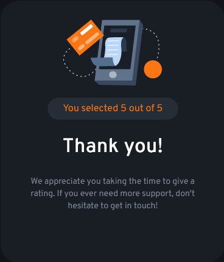
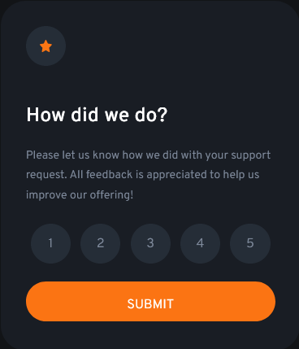

This is a solution to the [Interactive rating component challenge on Frontend Mentor](https://www.frontendmentor.io/challenges/interactive-rating-component-koxpeBUmI). Frontend Mentor challenges help you improve your coding skills by building realistic projects. 

## Table of contents

- [The challenge](#the-challenge)
  - [Screenshot](#screenshot)
  - [Links](#links)
- [My process](#my-process)
  - [Built with](#built-with)
  - [What I learned](#what-i-learned)
  - [Continued Development](#continued-development)
- [Author](#author)

### The challenge

Users should be able to:

- View the optimal layout for the app depending on their device's screen size
- See hover states for all interactive elements on the page
- Select and submit a number rating
- See the "Thank you" card state after submitting a rating

### Screenshot





### Links

- Solution URL: (https://github.com/marko-zivanic/RatingSolution)
- Live Site URL: (https://marko-zivanic.github.io/RatingSolution/Prototype/index.html)

## My process

I first made a rating HTML stucture. I needed to style it with CSS, and that was a challange to me. I haven't worked on CSS in a long time, but after googling minor fixes(like centering elements and images) I quickly got the hang of it. Next was the JavaScript which I wrote easly. After that I made the Thank You HTML structure and CSS, and made them switch by hiding the Rating HTML and unhiding the Thank You Structure.

### Built with

- HTML5
- CSS custom properties
- CSS Grid
- JavaScript
- jQuery

### What I learned

I got the hang of CSS styling and learned to analyze designs to implement in custom web pages. Overall this was a very positive experience.

PS I even made the Star at the top of the Rating screen animate on hover using the following code:

```js
$(".star-container").bind("webkitAnimationEnd mozAnimationEnd animationend", function(){
  $(this).removeClass("animated")  
})

$(".star-container").hover(function(){
  $(this).addClass("animated");        
})
```

### Continued development

This small project is finished and I look forward to completing more projects to improve my web development skills.
Big thanks to Frontend Mentor for giving me this challange!


## Author

- Website - [Marko Zivanic](https://marko-zivanic.github.io/website/)
